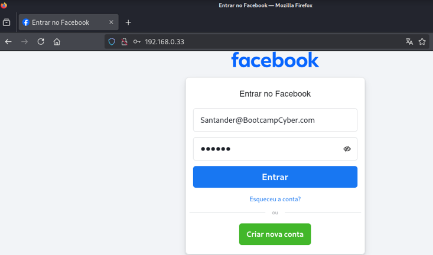
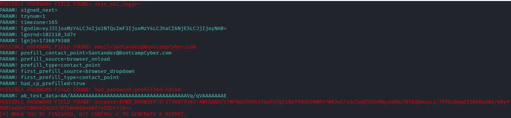

# Phishing para captura de senhas do Facebook

### Ferramentas

- Kali Linux
- setoolkit

### Configurando o Phishing no Kali Linux

- Acesso root: ``` sudo su ```
- Iniciando o setoolkit: ``` setoolkit ```
- Tipo de ataque: ``` 1) Social-Engineering Attacks ```
- Vetor de ataque: ``` 2) Web Site Attack Vectors ```
- Método de ataque: ```3) Credential Harvester Attack Method ```
- Método de ataque: ``` 2) Site Cloner ```
- URL para clone: ``` http://www.facebook.com ```

### Resutados



### Observação: 
Embora os dados de login (usuário e senha) tenham sido capturados, a informação de senha vem criptografada por conta de um novo script adicionado na página pelo Facebook. A solução poderia ser reverter a criptografia ou desabilitar o script em questão, mas ainda não foi possível realizar ambos os testes.
